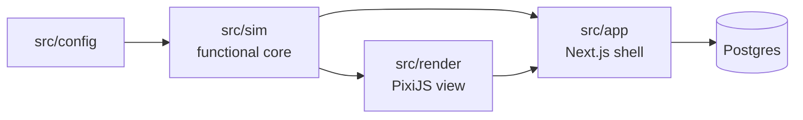
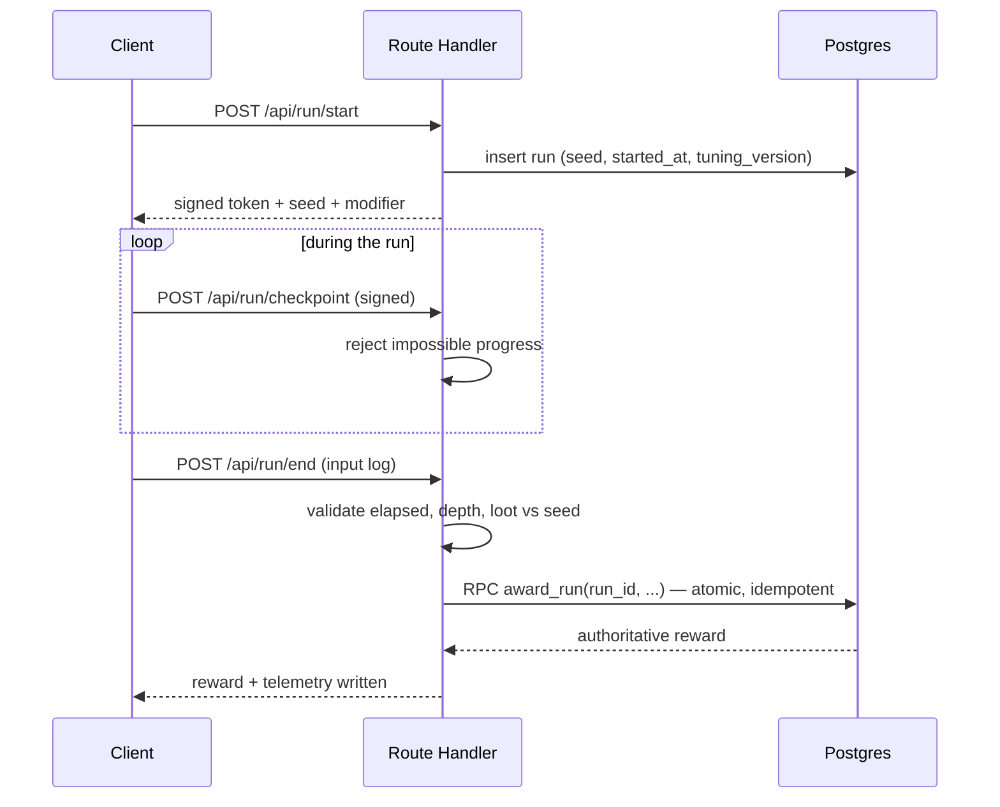
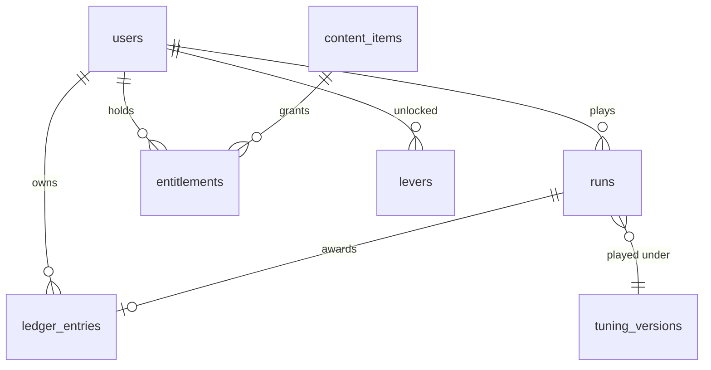
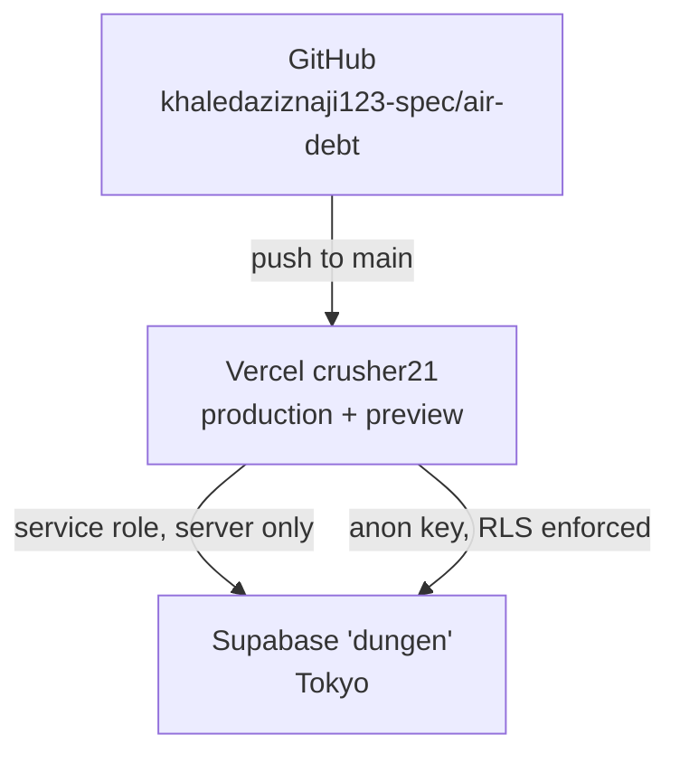

# Architecture Spine — Air Debt v1

## Design Paradigm

**Functional core, imperative shell.**

The simulation is a pure reducer — `step(state, intents, tick) → state`. It has no I/O, no
clock, no internal randomness, and no knowledge that a screen or a network exists. Everything
else is shell: the renderer, input devices, HTTP, storage, auth.

This is not a stylistic preference. PRD NFR-2 has three dependents that would otherwise each
need solving separately — identical combat timing across devices, server-side replay
validation, and tick-range hitbox authoring. A pure core delivers all three as a consequence
rather than as three features.

| Layer | Directory | Role |
|---|---|---|
| Core | `src/sim` | The game. Pure, isomorphic, dependency-light |
| Data | `src/config` | Tuning tables and schema. Imported by the core, imports nothing |
| Shell — view | `src/render` | PixiJS. Reads state, draws it |
| Shell — platform | `src/app` | Next.js routes, API handlers, auth, persistence |

## Invariants & Rules



Arrows point *toward the dependant*: `sim` may be imported by `render` and `app`; it may
import only `config` and the standard library. Nothing imports `app`.

### AD-1 — The simulation is a pure reducer

- **Binds:** all game logic; FR-1, FR-5–FR-8, FR-17–FR-20
- **Prevents:** one unit reading a clock or fetching while another does not, making runs irreproducible and validation unbuildable
- **Rule:** `src/sim` exposes `step(state, intents, tick) → state`. It returns new state, performs no I/O, and receives everything it needs as arguments.

### AD-2 — Ticks are the only unit of time `[ADOPTED]`

- **Binds:** all timing; FR-5, FR-9.5, FR-17, FR-19, FR-20
- **Prevents:** millisecond drift and per-device timing windows, which would make v2 leaderboards and v3 PvP compare different games
- **Rule:** `TICK_HZ = 60`. Every duration in the core and in tuning data is an integer tick count. Milliseconds appear only at the shell boundary.

### AD-3 — Nondeterministic APIs are banned inside the core `[ADOPTED]`

- **Binds:** `src/sim/**`
- **Prevents:** silent determinism drift, which surfaces as false-positive replay rejections that confiscate real players' loot
- **Rule:** No `Math.random`, `Date.now`, `performance.now`, `new Date`, transcendental `Math` functions, DOM globals, or `fetch`. Enforced by the ESLint override on `src/sim`; a violation fails the build.

### AD-4 — Randomness derives from a server-issued seed via named streams

- **Binds:** encounter placement, chest contents, trap placement, run modifier; FR-15.1, FR-18, FR-23
- **Prevents:** a change in how many chests a run rolls shifting every subsequent trap position and invalidating the entire stored replay corpus
- **Rule:** One `Rng` per concern, derived from the run seed by a stable stream id. Streams are never shared, and stream ids are never reused for a different concern.

### AD-5 — Dependency direction is one-way

- **Binds:** all modules
- **Prevents:** renderer or framework state leaking into the core — the failure that forecloses replay validation
- **Rule:** `config → sim → {render, app}`. `sim` imports only `config` and the standard library. Nothing imports `app`.

### AD-6 — Inputs are abstract, tick-stamped intents

- **Binds:** FR-5, FR-9, FR-15.5
- **Prevents:** device-specific behaviour reaching the core, and replay logs that only replay on the device that recorded them
- **Rule:** The shell translates keyboard and touch into one device-agnostic intent set before the core sees anything. The replay log is a list of `(tick, intent)`.

### AD-7 — The simulation is isomorphic

- **Binds:** `src/sim/**`; FR-15.7, NFR-2
- **Prevents:** play and validation drifting apart — the one bug class neither side can catch alone
- **Rule:** The same module runs unmodified in the browser and in a Node route handler. No Node-only and no browser-only APIs in the core.

### AD-8 — Server logic lives in Next Route Handlers; Supabase Edge Functions are not used in v1

- **Binds:** run lifecycle, reward computation, entitlements
- **Prevents:** a second runtime and a second deployment target, each needing its own determinism guarantees
- **Rule:** Server code is Node route handlers in `src/app/api`, importing the same TypeScript sim the browser runs. Edge Functions stay unused until something demands them.

### AD-9 — Postgres owns atomicity

- **Binds:** every economy mutation; FR-15.8, FR-16.3
- **Prevents:** partial awards and lost-update races — a serverless function cannot hold a transaction across multiple PostgREST round trips
- **Rule:** Each economy mutation is a **single** `SECURITY DEFINER` Postgres function invoked by RPC. Never a sequence of client-issued table calls.

### AD-10 — Balances are derived, never updated

- **Binds:** gems, gold, entitlements; FR-13, FR-15.8, FR-16.3
- **Prevents:** double-award from a retried request, and currency with no traceable origin
- **Rule:** An append-only ledger of deltas keyed by `(user, run_id, reason)` with a uniqueness constraint per award. Balance is a sum. A duplicate award is a constraint violation, not a silent doubling.

### AD-11 — Row-level security is deny-all on economy tables

- **Binds:** ledger, balances, entitlements, runs
- **Prevents:** client-trust creep — one permissive policy is all it takes
- **Rule:** No client role may insert or update these tables. Reads are scoped to the owning user. Writes happen only through `SECURITY DEFINER` functions or the service role, server-side.

### AD-12 — Tuning is server-owned versioned data, not code constants

- **Binds:** all values in `src/config/tuning.ts`; NFR-1.1, FR-15.7
- **Prevents:** a tuning change silently invalidating every stored replay, which would make replay validation worthless
- **Rule:** The client fetches a versioned tuning document; the local table is fallback and schema. **Every run record stores the tuning version it was played under**, and a replay is re-simulated against that version.

### AD-13 — Client-claimed loot is display-only `[ADOPTED]`

- **Binds:** FR-15.6
- **Prevents:** the counterfeiting vector that makes purchasable gold worthless
- **Rule:** The server computes the reward from seed, validated progress, and server-known gear. The number the client reports is never read back as truth.

### AD-14 — Content is retired by flag, never deleted

- **Binds:** items, potions, enemies, modifiers; NFR-1.2, NFR-1.3
- **Prevents:** an account that owns a removed item, or a historical run referencing a removed enemy, becoming unreadable
- **Rule:** Content rows carry an `active` flag. Retiring disables it for new runs and leaves every referencing row intact. Rows are never hard-deleted.

### AD-15 — Every run emits one telemetry envelope

- **Binds:** NFR-1.4, Success Metrics
- **Prevents:** each feature inventing its own event shape, leaving the counter-metrics unanswerable
- **Rule:** The server writes one fixed-shape record per run alongside the reward: run id, outcome (`extracted` / `died` / `transformed`), depth, environment reached, elapsed ticks, tuning version, device class, modifier.

### AD-16 — Assets are data; the core never names one

- **Binds:** `src/sim/**`, `src/render/**`; NFR-3.1
- **Prevents:** an art swap becoming a logic change — fatal when everything ships on CC0 placeholders first
- **Rule:** The core deals in entity and animation identifiers. The renderer maps identifiers to sprites, atlases and hitbox data loaded at runtime.

### AD-17 — Entitlements are server-resolved for third-party display

- **Binds:** cosmetics; FR-16.4, FR-16.5
- **Prevents:** a hacked client showing other players cosmetics it does not own — the only version of that attack that costs revenue
- **Rule:** Anything another player sees comes from the server's entitlement record, never relayed from the wearing client. Bites in v2/v3; the schema obligation is now.

### AD-18 — One Supabase client per context, never shared

- **Binds:** `src/app/**`
- **Prevents:** a server-created client leaking across requests — the standard Next App Router auth bug
- **Rule:** `@supabase/ssr` browser client for client components; a fresh server client per request for server components, actions and route handlers. No module-level singleton on the server.

### AD-19 — Runs are versioned against the simulation, not only the tuning

- **Binds:** run records, replay validation; FR-15.7, AD-12
- **Prevents:** the stored replay corpus rotting invisibly as the core evolves — a bug fix to parry resolution makes every earlier run re-simulate differently and get flagged as forged, confiscating real players' loot
- **Rule:** Every run record stores a `sim_version` alongside `tuning_version`. Replay validation only re-simulates runs whose `sim_version` matches the validator. Any change to core resolution bumps it.

### AD-20 — Every table has exactly one writer

- **Binds:** `runs`, `ledger_entries`, `entitlements`, `levers`
- **Prevents:** two write paths racing on the same row — the insert-versus-settle race that appears the moment requests retry
- **Rule:** The run row is created by the `/api/run/start` handler and thereafter mutated **only** by the award RPC. Ledger, entitlement and lever rows are written only by `SECURITY DEFINER` functions. No table accepts writes from two places.

### AD-21 — The core owns its input vocabulary

- **Binds:** `src/sim`, `src/render`, `src/app/api/run`; AD-6
- **Prevents:** the live-play shell and the replay validator each defining their own intent set and drifting by one member, which mis-validates every replay containing it
- **Rule:** The intent type is defined in `src/sim` and imported by every shell that produces or consumes it. No shell declares its own.

### AD-22 — Progress has one canonical unit

- **Binds:** `src/sim`, checkpoint payloads, plausibility bounds; FR-15.3, FR-15.4
- **Prevents:** the sim measuring position one way and the checkpoint API another, so the server's impossible-progress check either rejects honest runs or waves through absurd ones
- **Rule:** Progress is reported as `(environment_index, ticks_elapsed)`. Both are integers the core already owns. Nothing in a checkpoint or a validation bound uses world coordinates.

### AD-23 — Training runs are inert

- **Binds:** FR-25
- **Prevents:** the training path reusing the run-end handler and awarding currency — turning a practice room into a risk-free farming route, which is exactly what FR-25.3 forbids
- **Rule:** A training session never creates a run record, never calls the award RPC, and never emits a ledger entry. It runs the identical core with the identical tuning (FR-25.2) and writes nothing.

## Consistency Conventions

| Concern | Convention |
|---|---|
| Naming — files | `kebab-case.ts`. Tests sit beside their subject as `<name>.test.ts` |
| Naming — types | `PascalCase` types, `camelCase` values, `SCREAMING_SNAKE` for tick constants |
| Naming — database | `snake_case` tables and columns, plural table names, `id` as primary key, `<entity>_id` for references |
| Durations | Integer ticks everywhere inside `sim` and `config`. Seconds only in authoring helpers and UI copy |
| Ids | `uuid` for user and run ids; short stable string slugs for content (`potion.passage`, `enemy.goblin`) so they read in logs and survive renames |
| Content identity | The **slug is the join key**. The core never sees a database row id, and content tables use the slug as their primary key |
| Progress | `(environment_index, ticks_elapsed)` — see AD-22. Never world coordinates outside the core |
| Timestamps | `timestamptz`, UTC, server-generated. The client never supplies a time that matters |
| Money and currency | Integer counts only. No floats anywhere in the economy |
| API shape | Route handlers return `{ data }` or `{ error: { code, message } }`. Codes are stable strings, never numbers |
| Errors | The core throws only on programmer error. Expected failures are values in the returned state |
| Config | Read from `process.env` in `src/app` only. The core receives configuration as arguments |
| Secrets | `NEXT_PUBLIC_` prefix means public, permanently. The service role key never appears outside server code |
| Migrations | Every schema change is a checked-in migration. No dashboard edits to schema |

## Stack

Verified current at authoring, 2026-08-04. The code owns this once it exists.

| Name | Version |
|---|---|
| Node | 24.14.0 |
| TypeScript | 5.x |
| Next.js | 16.3.0 |
| React | 19.2.8 |
| PixiJS | 8.19.0 |
| @supabase/supabase-js | 2.111.0 — *not yet installed* |
| @supabase/ssr | 0.12.4 — *not yet installed; pre-1.0, treat minors as breaking* |
| Tailwind CSS | 4.x |
| Postgres | Supabase managed |
| Hosting | Vercel (`crusher21`) |
| Database | Supabase project `dungen` (`fdepkajrlzgwrrnioesz`, Tokyo) |

## Structural Seed

### Run lifecycle



### Core entities



### Deployment



### Source tree

```text
air-debt/
  src/
    sim/        # functional core — pure, isomorphic, no I/O
    render/     # PixiJS view layer
    config/     # tuning tables + schema
    app/        # Next.js routes and API handlers
      api/
        run/    # start, checkpoint, end
  supabase/
    migrations/ # every schema change, checked in
  _bmad-output/ # planning artifacts
```

## Capability → Architecture Map

| Capability / Area | Lives in | Governed by |
|---|---|---|
| Combat, movement, parry, stun | `src/sim` | AD-1, AD-2, AD-3, AD-6 |
| Oxygen budget, air tank | `src/sim` + `src/config` | AD-2, AD-12 |
| Dungeon layout, shortcuts, levers | `src/sim`, `levers` table | AD-4, AD-10 |
| Run reshuffle and modifiers | `src/sim` | AD-4 |
| Rendering, animation, debug overlay | `src/render` | AD-5, AD-16 |
| Input, device selection, layout config | `src/app` → `src/render` | AD-6 |
| Run validation | `src/app/api/run` | AD-7, AD-8, AD-13 |
| Gems, gold, the 70% rule | Postgres functions | AD-9, AD-10, AD-11 |
| Potions and shop | `src/app` + Postgres | AD-9, AD-14 |
| Cosmetics and entitlements | Postgres | AD-11, AD-17 |
| Telemetry | `src/app/api/run` | AD-15 |
| Auth | `src/app` | AD-18 |
| HUD — depth meter and gem counter | `src/render` | AD-5, AD-22 |
| Between-run screen — shop, upgrades, loadout | `src/app` + Postgres | AD-9, AD-11, AD-14 |
| Hard Mode | `src/sim` + `src/config` | AD-12, AD-14 |
| Training mode | `src/sim` + `src/render`, no server path | AD-23 |

## Deferred

| Deferred | Why it can wait |
|---|---|
| **Whether the core uses ECS internally** | Orthogonal to the spine. ECS can be adopted inside `src/sim` later without changing a single AD — though it gets more expensive the longer the core grows |
| **Anonymous player identity** | The brief promises play with no account wall, and AD-10 keys the ledger by user. Whether an anonymous player gets a shadow user row or a device-local id reconciled at signup is undecided. **Constraint on whichever is chosen: progress must survive account linking without loss.** Decide before the first persistence story |
| **Replay re-simulation job** | AD-7 and AD-12 make it a sampling job rather than a rewrite. Logs accrue from day one; the job is built when the corpus justifies it |
| **Separate staging Supabase project** | One project across all environments is accepted for a solo pre-launch build. Revisit before the first real player data exists |
| **Rate limiting and abuse alerting** | The v1 threat is currency forgery, which AD-9/10/11/13 close. Statistical alerting needs telemetry volume that does not yet exist |
| **Payments provider and webhook shape** | Monetization is v2. AD-17's schema obligation is met now so the choice stays open |
| **Realtime transport for PvP** | v3, and explicitly the highest-risk piece in the brief. Nothing here forecloses it |
| **Asset pipeline and atlas packing** | Placeholder CC0 art first; AD-16 keeps the swap cheap |
| **Native mobile wrapper** | Web validates first. AD-5 and AD-7 are what keep the core portable |
